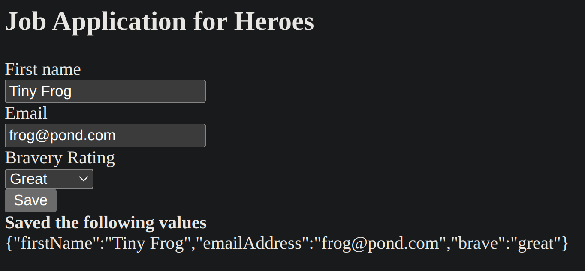
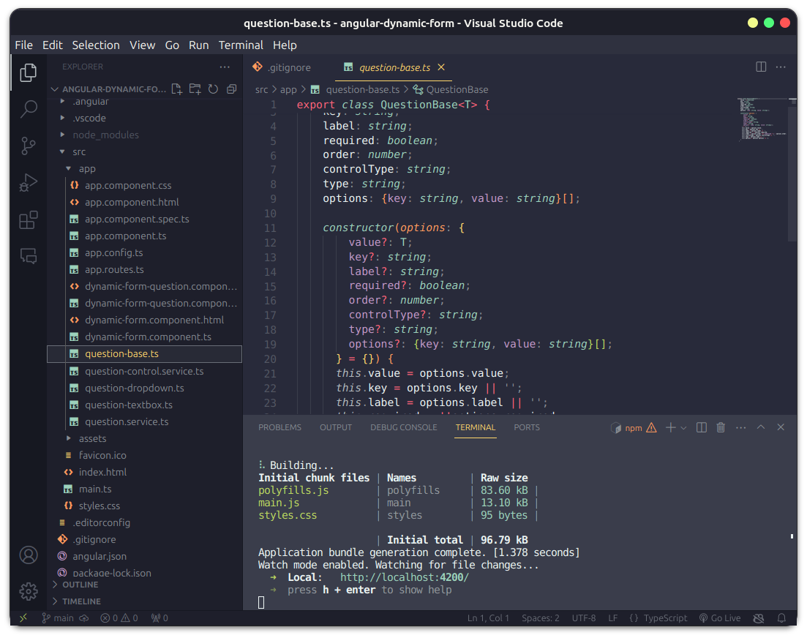

## MyAngularForm

This project was generated with [Angular CLI](https://github.com/angular/angular-cli) version 17.2.1.

## Further help

To get more help on the Angular CLI use `ng help` or go check out the [Angular CLI Overview and Command Reference](https://angular.io/cli) page.

# Dynamic Forms in Angular

https://angular.io/guide/dynamic-form

This link directs to the official Angular guide on dynamic forms, which are crucial components of modern web development, enabling the creation of interactive and adaptive user interfaces that dynamically respond to user input. Angular, in turn, is a development platform for building web and mobile applications using HTML, CSS, and TypeScript.

## Concepts Learned

1- **Field and Control Management**: The documentation explains techniques for adding, removing, and managing fields and controls in dynamic forms, allowing for customization of forms as needed. Additionally, it covers rendering fields conditionally based on specific logic, creating a more personalized user experience.

2- **Data Validation**: The tutorial also explores how to validate user-entered data in dynamic forms, ensuring that only valid data is submitted.

3- **Event Handling**: Techniques for handling events and user interactions in dynamic forms are presented, such as capturing user inputs and responding to them appropriately.

The image depicts the form itself. To ensure valid input, the Save button is disabled until the form is in a valid state. When the form is valid, click Save, and the application renders the current form values as JSON.

