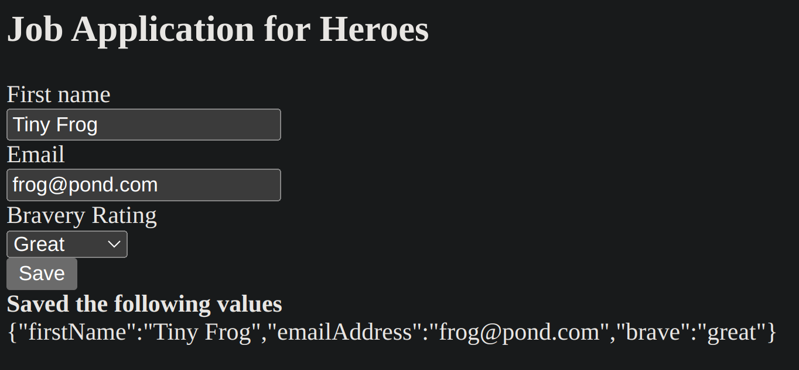

## MyAngularForm

This project was generated with [Angular CLI](https://github.com/angular/angular-cli) version 17.2.1.

## Further help

To get more help on the Angular CLI use `ng help` or go check out the [Angular CLI Overview and Command Reference](https://angular.io/cli) page.

# Formulários Dinâmicos no Angular

https://angular.io/guide/dynamic-form

Esse link direciona para o guia oficial do Angular sobre formulários dinâmicos, esses que por sua vez são uma parte crucial do desenvolvimento de aplicativos web modernos, permitindo a criação de interfaces de usuário interativas e adaptáveis que respondem dinamicamente às entradas dos usuários. O Angular por sua vez é uma plataforma de desenvolvimento para a construção de aplicativos web e móveis utilizando HTML, CSS e TypeScript.

## Conceitos aprendidos

1- **Gerenciamento de Campos e Controles**: A documentação explica técnicas para adicionar, remover e gerenciar campos e controles em formulários dinâmicos, permitindo a personalização dos formulários de acordo com a necessidade. Além disso, são abordatas algumas formas de renderizar campos de formulário de forma condicional, com base em uma lógica específica, criando uma experiência de usuário mais personalizada.

2- **Validação de Dados**: O tutorial também explora como validar os dados inseridos pelos usuários em formulários dinâmicos, garantindo que apenas dados válidos sejam submetidos.

3- **Manipulação de Eventos**: São apresentadas técnicas para lidar com eventos e interações do usuário em formulários dinâmicos, como capturar entradas do usuário e responder a elas de maneira adequada.

A imagem mostra o formulário em si. Para garantir uma entrada válida, o botão Salvar é desabilitado até que o formulário esteja em um estado válido. Quando o formulário está válido, clique em Salvar e o aplicativo renderiza os valores atuais do formulário como JSON.

